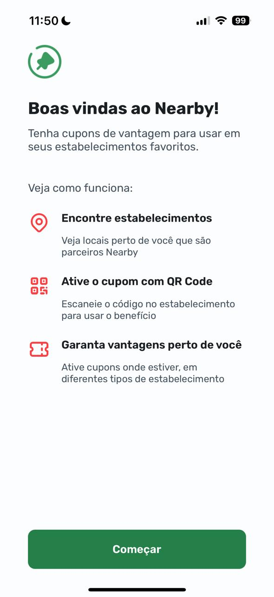
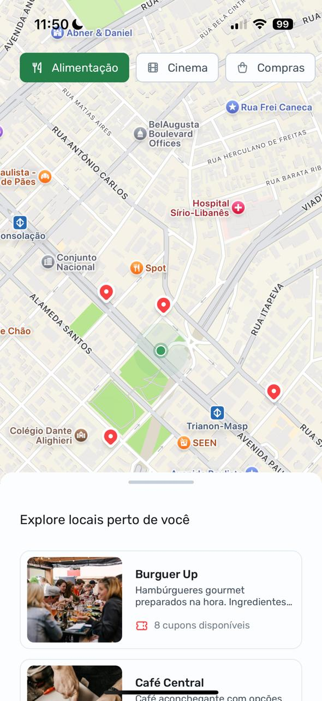

# NLW Pocket Mobile

<p align="center">
  
  
</p>

## 📱 Sobre o Projeto

Nearby é um aplicativo desenvolvido durante o evento Pocket NLW da Rocketseat, focado em criar uma plataforma de clube de benefícios móvel. O aplicativo permite aos usuários encontrar e utilizar cupons de desconto em estabelecimentos próximos à sua localização.

## ✨ Funcionalidades

- **Localização em Tempo Real**: Encontre estabelecimentos próximos a você
- **Scanner de Cupons**: Escaneie e utilize cupons promocionais diretamente pelo aplicativo
- **Benefícios Exclusivos**: Acesse descontos e promoções especiais

## 🚀 Tecnologias Utilizadas

- [React Native](https://reactnative.dev/) - Framework para desenvolvimento mobile
- [Node.js](https://nodejs.org/) - Ambiente de execução JavaScript
- [Expo](https://expo.dev/) - Plataforma para desenvolvimento React Native

## 🔧 Instalação e Configuração

### Back-end

1. Clone o repositório da API:
```bash
git clone [https://github.com/rocketseat-education/nlw-pocket-mobile-rn]
```

2. Instale as dependências:
```bash
cd [PASTA_DA_API]
npm i
```

3. Para iniciar o server:
```bash
npm start
```

### Front-end (Mobile)

1. Clone o repositório mobile:
```bash
git clone [https://github.com/carolsauhi/mobile]
```

2. Instale as dependências usando Expo:
```bash
cd [PASTA_DO_MOBILE]
npx expo install
```

3. Para iniciar o aplicativo:
```bash
npx expo start
```

## 📝 Notas

- Este projeto foi desenvolvido durante o evento NLW da Rocketseat
- A API utilizada foi fornecida pela equipe da Rocketseat
- É necessário ter o ambiente React Native configurado para executar o projeto

## 📄 Licença

Este projeto está sob a licença MIT.

---

Feito com ❤️ durante o NLW da [Rocketseat](https://rocketseat.com.br/)
